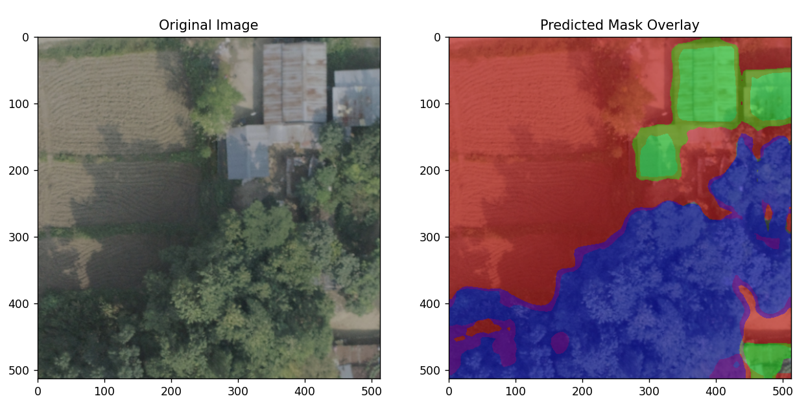

# Drone Image-Based Landcover Segmentation

## Overview
This project focuses on segmenting landcover using drone imagery of Butwal Ward No. 6. The goal is to process high-resolution images, train a segmentation model, and evaluate its performance in identifying different landcover classes.

## Project Structure

- **Data**: The data consists of high-resolution `.tif` images and associated shapefiles.
- **Model**: DeepLab v3 is used as the segmentation model, implemented in `deemodel.py`.
- **Training**: The training pipeline is managed using the script `train4.py`.
- **Preprocessing**: Preprocessing steps, including rasterizing shapefiles and patch extraction, are handled in the Jupyter Notebook `project.ipynb`.
- **Testing**: Model testing and evaluation are performed using `newtest4.py`.

---



## Getting Started

### Prerequisites
Ensure you have the following installed:

- Python 3.9
- Required Python libraries 


### Dataset

The dataset includes:

- `.tif` files for drone imagery.
- Shapefiles (`.shp`) containing ground truth data for segmentation.


---

## Workflow

### Preprocessing

The preprocessing steps include:

1. **Rasterizing Shapefiles**: Convert the shapefiles into raster format aligned with the `.tif` images.
2. **Patch Extraction**: Cut the `.tif` images into smaller patches suitable for training.

Run the preprocessing steps in `project.ipynb`.

### Training

To train the DeepLab v3 model:

1. Open and configure `train4.py` with the desired parameters (e.g., epochs, learning rate).
2. Run the script:

```bash
python train4.py
```

### Testing

To evaluate the trained model:

1. Ensure the model weights are saved in the appropriate location.
2. Run the testing script:

```bash
python newtest4.py
```

---

## File Details

### Scripts

- **`deemodel.py`**: Contains the implementation of the DeepLab v3 model.
- **`train4.py`**: Script for training the segmentation model.
- **`newtest4.py`**: Script for testing the model on new data.

### Notebooks

- **`project.ipynb`**: Includes preprocessing steps such as rasterization and patch generation.

### Data

- `.tif` files: High-resolution drone images.
- `.shp` files: Ground truth annotations for landcover.

---


## Contact

For questions or feedback, please contact [gautamaayush305@gmail.com].
